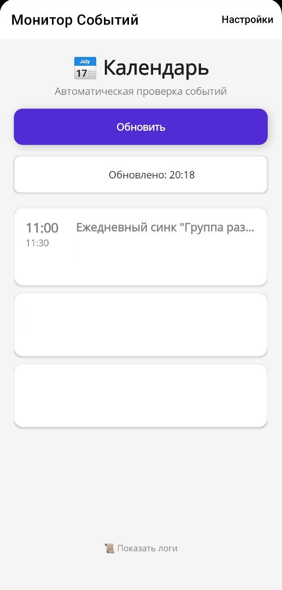

# CalendarScrubber

Скачать можно здесь https://github.com/energizet/CalendarScrubber/releases

Чтобы приложение можно отображат страницу с будильником при заблокированом экране - нужно выдать разрешение на показ приложения поверх других приложений и отображение на экране блокировки

Желательно выключить весь контроль активности приложения и включить автозапуск в настройках телефона
**особенно касается китайских брендов**

Приложение вытаскивает все встречи в календаре на ближайшие 24 часа и заводит будильник перед встречей

Будильник по умолчанию выключен

